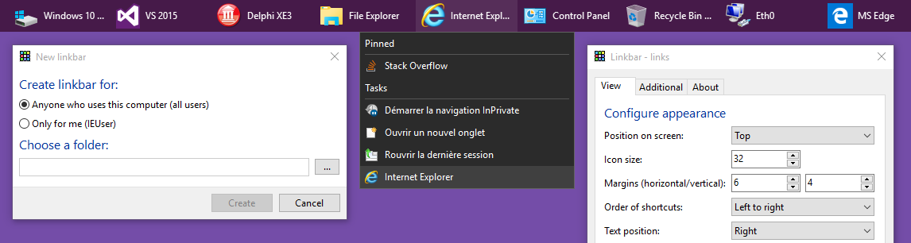

What is Linkbar ?
===============================
Linkbar is a free source code desktop toolbar. Running in the MS Windows Vista+ environment, its use is governed by
MIT License.

Description
-------------------------------
See [README.txt](https://github.com/ATGH15102AFMLD/Linkbar/blob/master/exe/README.txt)

Build
-------------------------------
Build with Embarcadero Delphi 10.3 Community Edition or higher

Download
-------------------------------

